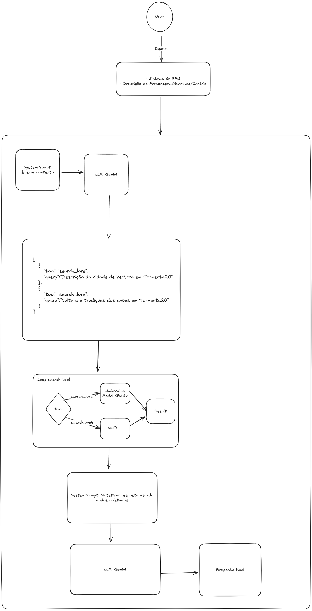

# RPG Context Enhancer - Prova de Conceito (POC)

RPG Context Enhancer é um assistente de IA projetado para enriquecer a criação de personagens, aventuras e cenários de RPG de mesa. 
A partir de uma simples descrição, a ferramenta utiliza IA para buscar e sintetizar informações contextuais, seja de universos de fantasia específicos ou de períodos históricos do mundo real.
Esta POC foi desenvolvida como um estudo prático de arquiteturas de software para IA, combinando RAG (Retrieval-Augmented Generation) e o uso de Ferramentas (Tools).


## Funcionalidades Principais

### Busca Dupla de Contexto: 
A ferramenta pode buscar informações em duas fontes distintas:
- **Lore do Jogo (RAG):** Consulta uma base de dados vetorial local com as regras e a história de um sistema de RPG específico (ex: Tormenta20).
- **Mundo Real (Web Search):** Realiza buscas na web para obter contexto histórico, social e cultural de um determinado período e local (ex: Brasil, 1943).

### Geração Aumentada: 
As respostas são geradas por um Modelo de Linguagem (LLM), mas "aumentadas" com os dados recuperados, garantindo informações precisas e canônicas.


## Arquitetura
O núcleo desta POC é a combinação da arquitetura de agentes (Controlador,  Percepção, Modelo) com a técnica RAG (Retrieval-Augmented Generation) e uso de Tools (Ferramentas).

- **Controlador (Controller):** O orquestrador principal da aplicação. Ele recebe a requisição do usuário, consulta o Modelo para saber o que fazer e aciona as ferramentas da Percepção.
- 
- **Percepção (Perception):** A camada que interage com o "mundo". É composta por um conjunto de ferramentas que o Controlador pode acionar:
  - **search_lore:** Uma ferramenta RAG que busca informações em uma base de dados vetorial (FAISS/ChromaDB) criada a partir dos livros de regras do RPG.
  - **search_web:** Uma ferramenta que consulta uma API de busca (ex: Google Search) para obter informações do mundo real.

- **Modelo (Model):** O "cérebro" do sistema. Utiliza um LLM para:
  - Analisar a intenção do usuário. 
  - Criar um plano de ação, decidindo qual ferramenta usar para cada etapa. 
  - Sintetizar os dados coletados em uma resposta final coesa.





## Como executar

### Pré-requisitos
- Python 3.9+
- Uma chave de API para um serviço de LLM (ex: OpenAI)
- Documentos do sistema de RPG que você deseja usar (em formato .txt ou .pdf)

### Instalação

Clone o repositório e instale as dependências:
```
git clone https://github.com/seu-usuario/rpg-context-enhancer.git
cd rpg-context-enhancer
pip install -r requirements.txt
```

Crie um arquivo .env na raiz do projeto para armazenar suas chaves de API:

```
GOOGLE_API_KEY=
SEARCH_ENGINE_ID=
```

### Construção da Base de Conhecimento (RAG)
Antes de executar a aplicação, você precisa criar a base de dados vetorial para o seu sistema de RPG.
Adicione seus arquivos de lore (ex: Tormenta20.pdf) na pasta data/.
Execute o script de indexação, para mais informaçoes acesse:

[Rpg-Box-Indexer](rpg-book-indexer)

Este script irá processar o documento, dividi-lo em chunks, gerar os embeddings e salvar um índice FAISS em vector_stores/Tormenta20_index. 

Obs. Somente arquivos .pdf

### Execução
Para iniciar o assistente, execute o arquivo principal:

```
python3 main.py
```

A aplicação irá então pedir que você insira seu prompt, como nos exemplos abaixo.


## Exemplos de Uso

### Exemplo 1: Usando a Ferramenta de Lore (RAG)

Seu Prompt:
```
Sistema de RPG: Tormenta20
Pedido: Quero criar um Qareen (gênio) bardo que vive no reino de Wynlla. Me dê informações sobre o reino e como um Qareen seria visto lá.
```

Plano de Ação Gerado pelo Modelo:
```
[search_lore] Buscar informações sobre o reino de Wynlla em Tormenta20.
[search_lore] Pesquisar a cultura e a sociedade dos Qareen em Tormenta20.
[search_lore] Encontrar detalhes sobre a relação entre magia, arte e a nobreza em Wynlla.
```

## Exemplo 2: Usando a Ferramenta de Busca Web

```
Seu Prompt:
Sistema de RPG: Chamado de Cthulhu
Pedido: Preciso de um cenário para uma aventura que se passa no Rio de Janeiro durante o ano de 1955. Qual era o clima político e cultural da época?
```

Plano de Ação Gerado pelo Modelo:
```
[search_web] Contexto político do Brasil em 1955, após o suicídio de Vargas.
[search_web] Cultura e música popular no Rio de Janeiro em meados dos anos 50, início da Bossa Nova.
[search_web] Lugares icônicos e vida cotidiana na cidade do Rio de Janeiro na década de 1950.
```

## Técnicas e Conceitos Estudados
**Arquitetura de Agentes:** Separação clara de responsabilidades entre o cérebro (Modelo), o tomador de ação (Controlador) e as ferramentas (Percepção).

**Retrieval-Augmented Generation (RAG):** Redução de alucinações e fornecimento de respostas baseadas em fontes confiáveis, combinando busca em base de dados com a capacidade de geração de LLMs.

**Roteamento de Ferramentas (Tool Routing):** Habilidade do Modelo de escolher a ferramenta mais apropriada para uma tarefa, permitindo que o sistema resolva problemas mais complexos e multifacetados.

**Engenharia de Prompts (Prompt Engineering):** Criação de instruções detalhadas para guiar o LLM na criação de planos e na síntese de respostas.

**Embeddings e Bancos de Dados Vetoriais:** Uso de sentence-transformers e FAISS para criar um sistema de busca semântica eficiente e local.